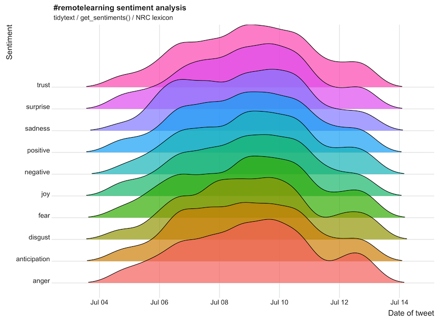
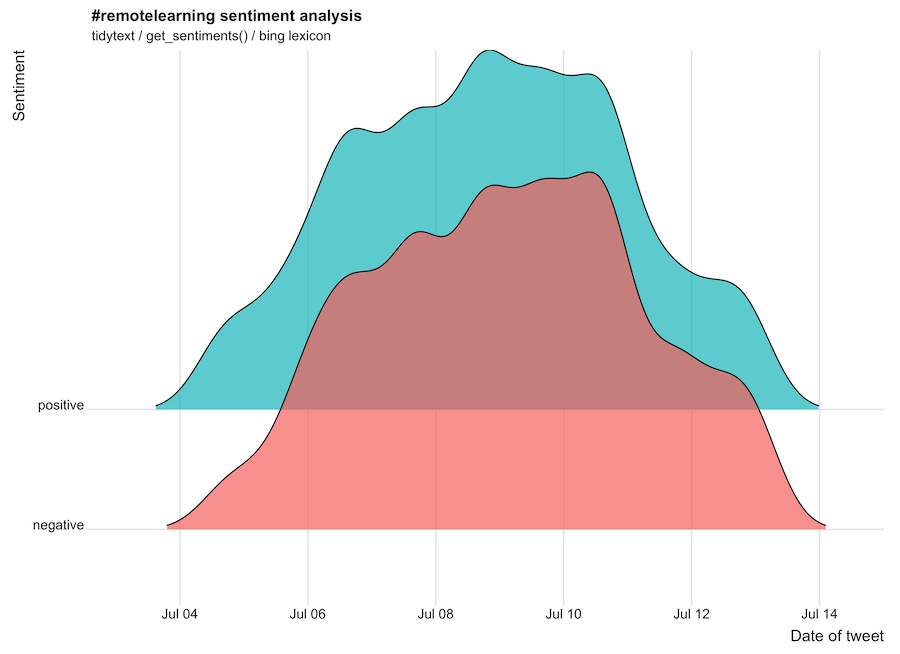

```{r child = "setup.Rmd"}
```

```{r libraries, include=FALSE, message=FALSE}

## install packages
# install.packages(c("tidyverse","tidytext","rtweet"), dep = TRUE)

library(tidyverse) 
library(tidytext)
library(rtweet)
library(DT)

# include API keys
source("keys.R")
```

<br>

## Aim 
Use the Twitter API as a method of data collection to investigate how educators tweeting using education hashtags (EG: #remotelearning) are adapting their online learning designs to support positive socioemotional outcomes for their students. 

&nbsp;  

## Scope {.tabset}
This evaluation was conducted on Monday 13 July 2020 at the commencement of the second stage of home schooling restrictions.

### Purpose
Investigate how teachers support students’ socioemotional outcomes in online learning contexts through aspects of their learning design.

### Background
As a response to the coronavirus (COVID-19) pandemic Victorian schools implemented remote learning during Term 2 (April–June 2020) where most students learnt from home under their school's guidance. 

A surge in reported cases has led to a return to Stage 3 'Stay at Home' restrictions with most students in Victorian schools returning to flexible and remote learning for the start of Term 3 (20 July 2020).

### Keywords (hastags)
* #remotelearning 
* #flexiblelearning


```{r query, echo=FALSE, message=FALSE}

## search for live tweets
# tweets <- search_tweets(q = "#remotelearning", n = 18000, include_rts = FALSE, `-filter` = "replies", lang = "en")

## load saved results
tweets <- readr::read_csv(here::here("Data", "tweets-remotelearning.csv"))

```

## Results {.tabset}

### Sample of tweets with `#remotelearning`

```{r saveresults, echo=FALSE, message=FALSE}

tweets %>%
  sample_n(30) %>%
  select(created_at, screen_name, text, retweet_count)  %>%
  DT::datatable(editable = list(target = 'row', pageLength = 5, lengthMenu = c(5, 10, 15, 20)))

# write_as_csv(tweets, "data/tweets-remotelearning.csv")

```

### Timeline of tweets 

```{r timeline, echo=FALSE, message=FALSE}

ts_plot(tweets, "hours") +
  labs(x = NULL, y = NULL,
       title = "Frequency of tweets with #remotelearning hashtag",
       subtitle = paste0(format(min(tweets$created_at), "%d %B %Y"), " to ", format(max(tweets$created_at),"%d %B %Y")),
       caption = "Data collected from Twitter's REST API via rtweet") + theme_minimal()

```

## Most active users/hashtags {.tabset}

### Top tweeters

```{r toptweeters, echo=FALSE, message=FALSE}

tweets %>%
  count(screen_name, sort = TRUE) %>%
  top_n(20) %>%
  mutate(screen_name = paste0("@", screen_name))  %>%
  DT::datatable(editable = list(target = 'row', pageLength = 5, lengthMenu = c(5, 10, 15, 20)))

```

### Top hashtags

```{r tophashtags, echo=FALSE, message=FALSE}

tweets %>%
  unnest_tokens(hashtag, text, "tweets", to_lower = FALSE) %>%
  filter(str_detect(hashtag, "^#"), hashtag != "#remotelearning") %>%
  count(hashtag, sort = TRUE) %>%
  top_n(30) %>%
  DT::datatable(editable = list(target = 'row', pageLength = 5, lengthMenu = c(5, 10, 15, 20)))

```


## Most popular tweet  {.tabset}

### Most retweeted tweet

```{r mostretweets, echo=FALSE, message=FALSE}

tweets %>%
  arrange(-retweet_count) %>%
  slice(1) %>%
  select(created_at, screen_name, text, retweet_count) %>%
  DT::datatable(editable = list(target = 'row', pageLength = 5, lengthMenu = c(5, 10, 15, 20)))

```

### Most liked tweet

```{r mostliked, echo=FALSE, message=FALSE}

tweets %>%
  arrange(-favorite_count) %>%
  top_n(5, favorite_count) %>%
  select(created_at, screen_name, text, favorite_count) %>%
  DT::datatable(editable = list(target = 'row', pageLength = 5, lengthMenu = c(5, 10, 15, 20)))

```


## Sentiment matching

The `tidytext` package makes it easy to match words against different lexicons (vocabularies). For this analysis we will compare results using the `NRC` and `bing` lexicons.  

<br />  
<!-- The get_sentiments() function returns a data frame, a simple table join makes the lexicon part of the analysis. -->



<br />




